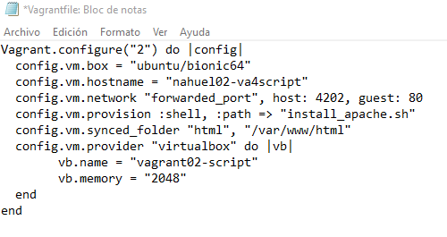
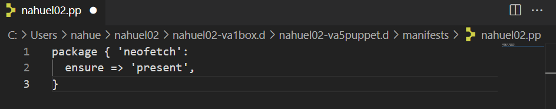
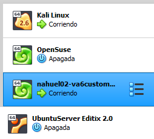

# ACTIVIDAD 4 IDP

***Nahuel Ivan Troisi***
 
***1º de Ciclo Superior de Administración de Sistemas Informáticos en Red***

## AÑADIR CAJAS

a) Creamos un nuevo fichero donde alojar todos nuestros archivos de Vanguard.   

b) Creamos un archivo "Vagrantfile" con la siguiente configuración.   

c) Levantamos la máquina creada.      

d) Accedemos a la máquina mediante SSH.   

## REDIRECCIÓN DE PUERTOS

a) Editamos el archivo "Vagrantfile".   

b) Levantamos la máquina con la nueva configuración.   

c) Comprobamos que se han efectuado los cambios.   

d) Mediante SSH instalamos "Apache2" en la MV.   

e) Comprobamos el puerto asignado.   

f) Eliminamos la MV.   

## SUMINISTRO MEDIANTE SHELL SCRIPT

a) Mediante VisualStudio, creamos un archivo HTML en nuestra carpeta de Vagrant.   

b) Del mismo modo, creamos un script con la siguiente configuración.   

c) Editamos el archivo de configuración "Vagrantfile".   

d) Levantamos la MV para comprobar que se han efectuado los cambios.    

e) Comprobamos que podemos acceder al servidor Apache.   
 
## SUMINISTRO MEDIANTE PUPPET

a) Editamos el archivo de configuración "Vagrantfile".   

b) Creamos el siguiente archivo mediante VisualStudio.   

c) Levantamos la MV.   

d) Cambiamos el nombre de la MV en el archivo de configuración.   

e) Comprobamos que se ha efectuado el cambio.   

## CAJA PERSONALIZADA

a) Instalamos el servicio SSH en la MV.   

b) Añadimos el usuario "Vagrant" a la MV.   

c) Accedemos con usuario Vagrant y configuramos el acceso por clave pública.      

d) Editamos el archivo "Sudoers" para conceder permisos a Vagrant.       

e) Creamos la caja.   

f) Comprobamos que se ha creado correctamente.   

g) Añadimos la caja a nuestra carpeta de archivos.   

h) Comprobamos la lista de cajas para corroborar que se ha añadido correctamente.   

i) Editamos el archivo de configuración "Vagrantfile".   

j) Levantamos la MV y comprobamos que se ejecuta correctamente. 

## CAJA WINDOWS

a) Buscamos la MV que más nos guste y la añadimos a través de Vagrant.   

b) Listamos las MV para comprobar que se ha añadido correctamente.   

c) Levantamos la MV.   

d) Comprobamos que se ha realizado correctamente.      

