# ACTIVIDAD 6 IDP

***Nahuel Ivan Troisi***
 
***1º de Ciclo Superior de Administración de Sistemas Informáticos en Red***

## CONFIGURACIÓN DE LA MV

a) Vamos a hacer uso de dos máquinas virtuales, la primera va a ser reciclada de la anterior práctica
y la otra la vamos a crear nueva, pero sin instalar el sistema operativo, ya que va a instalarse a través
de PXE.   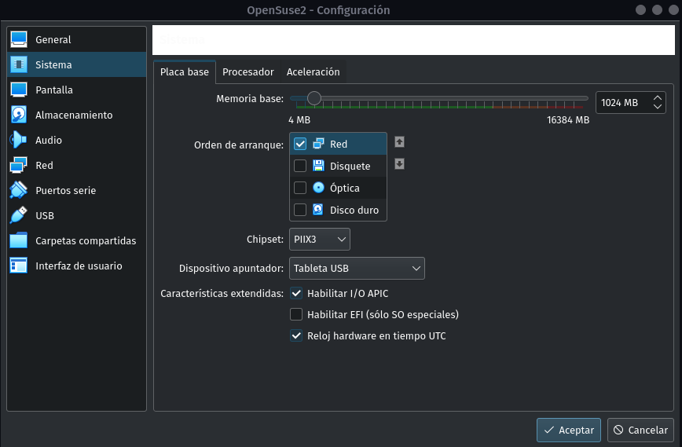

## SERVICIO DHCP

a) Instalamos el servicio DHCP en la MV 1.   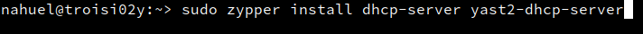

b) Editamos la interfaz de uso.   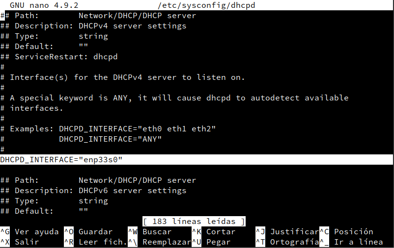

c) Editamos el archivo de configuracion del DHCP.   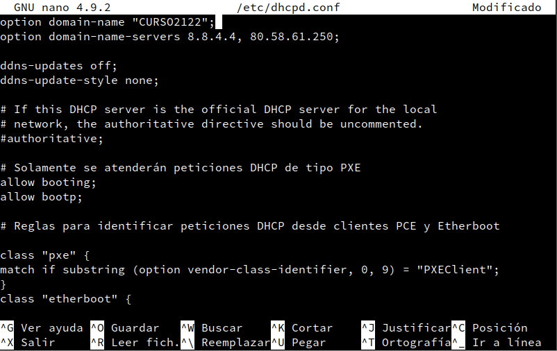

## SERVICIO TFTP

a) Editamos la configuración del servicio TFTP después de haberlo instalado y reemplazamos
la dirección ip por defecto por la que posea nuestra MV.   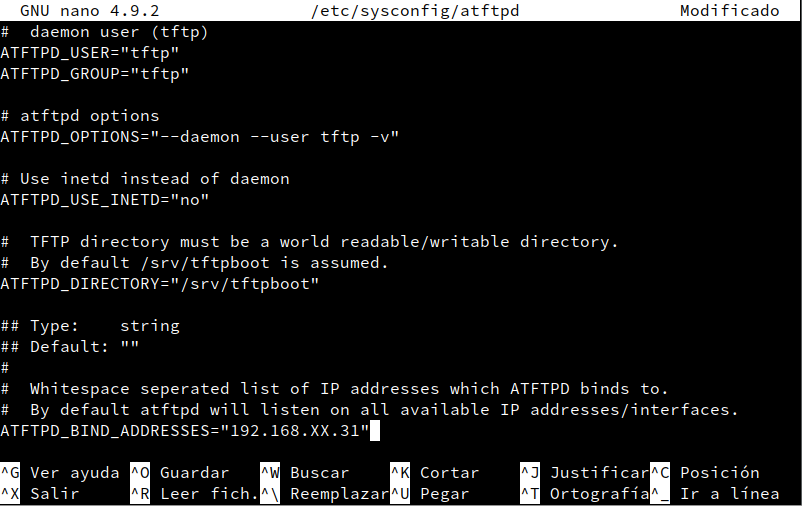

## SERVIDOR NFS

a) Creamos un punto de montaje para la ISO.   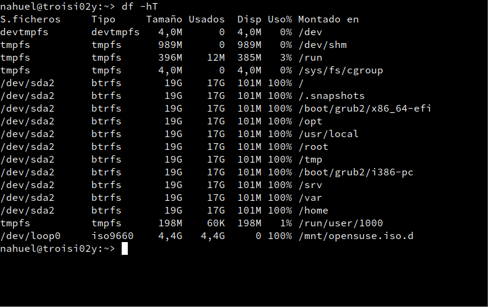 

b) Editamos el archivo de configuración "/etc/exports".   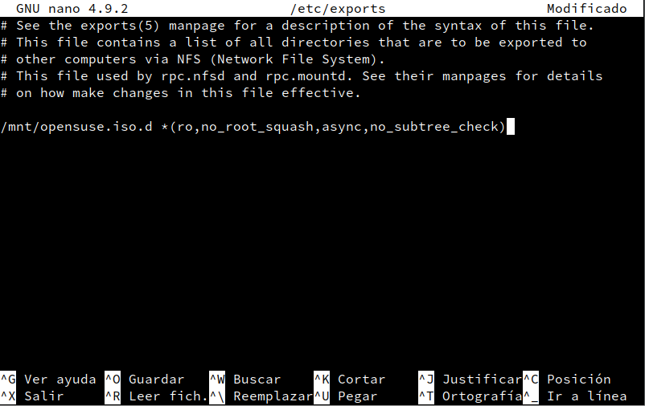 

## MENÚ DE ARRANQUE 

a) Creamos los siguientes directorios.   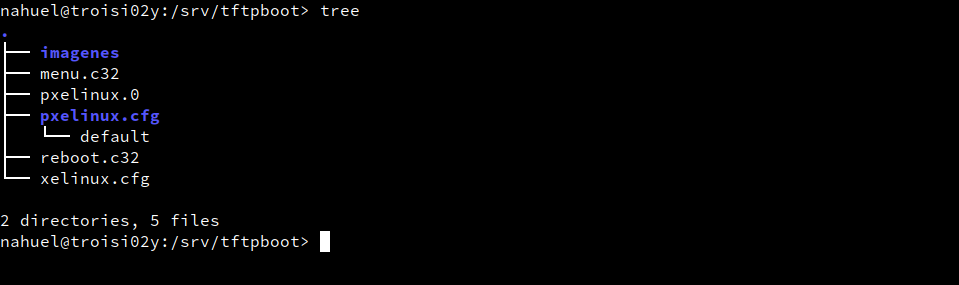 

b) Editamos el archivo de arranque.   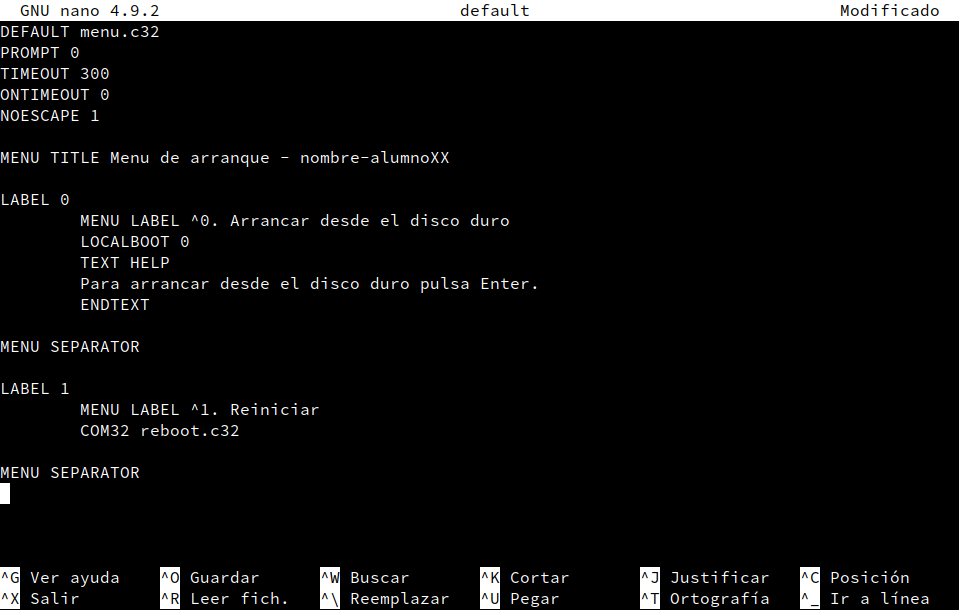 

## CONFIGURACIÓN DE UNA IMAGEN PARA INSTALAR 

a) Editamos el archivo del bootloader.   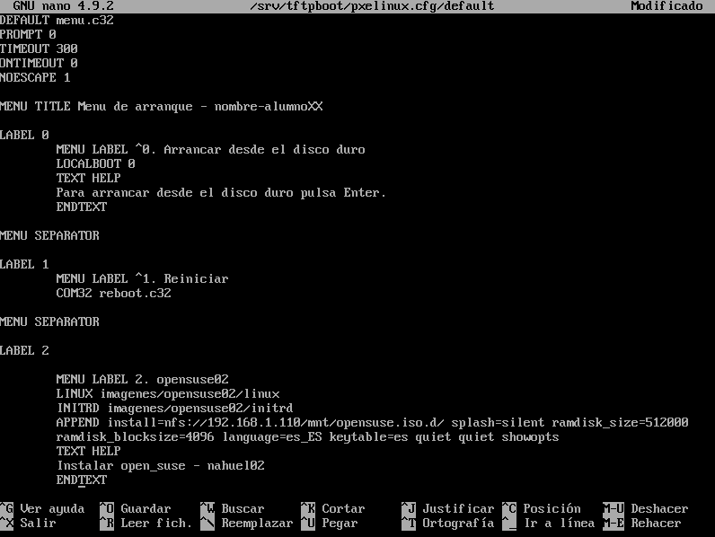 

b) Comprobamos que la MV 2 arranca desde el menú PXE.   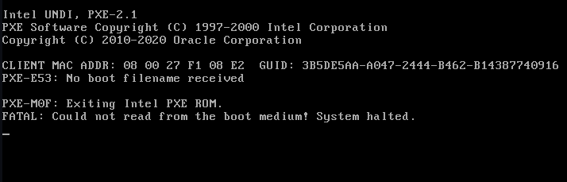
